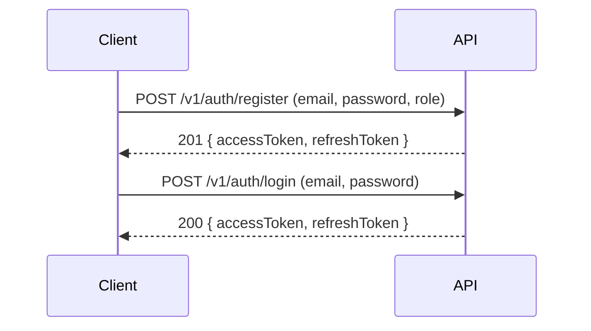
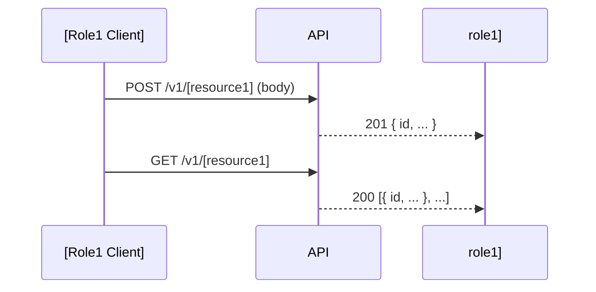
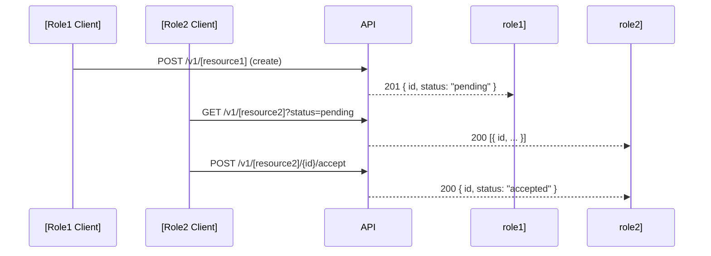
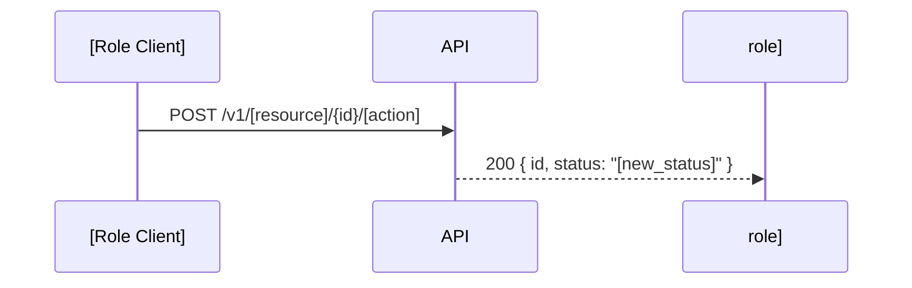

# Sequence Diagrams

> **Template placeholder.** Replace this file with your domain's sequence diagrams.  
> Run `task domain:init` to copy this template, then edit the copy in `docs/specifications/`.

---

## Overview

This document contains Mermaid sequence diagrams for the key interaction flows in this domain.

Each diagram shows the sequence of API calls and system events for a specific user journey.

---

## Flow 1: [Name — e.g. Registration and Login]

> TODO: Replace with your domain's registration/login flow, or remove if not applicable.

---

## Flow 2: [Name — e.g. Create and List Resource1]

> TODO: Replace with your domain's primary resource creation flow.

---

## Flow 3: [Name — e.g. Cross-role interaction]

> TODO: Replace with a flow showing how two roles interact through the API.

---

## Flow 4: [Name — e.g. State transition]

> TODO: Add flows for each significant state transition in your domain.

---

## Notes

- All authenticated requests include `Authorization: Bearer <token>` header (omitted from diagrams for brevity)
- `4xx` error paths are omitted from diagrams; see `auth-matrix.md` for access control rules
