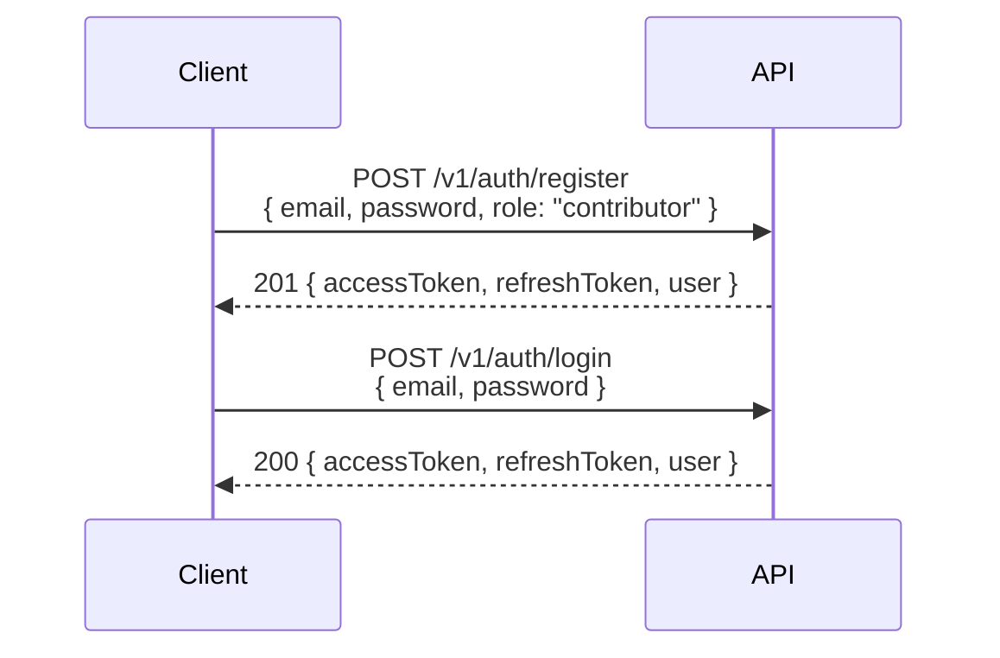
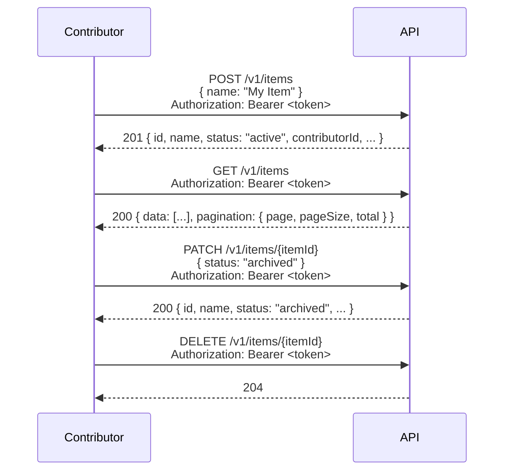
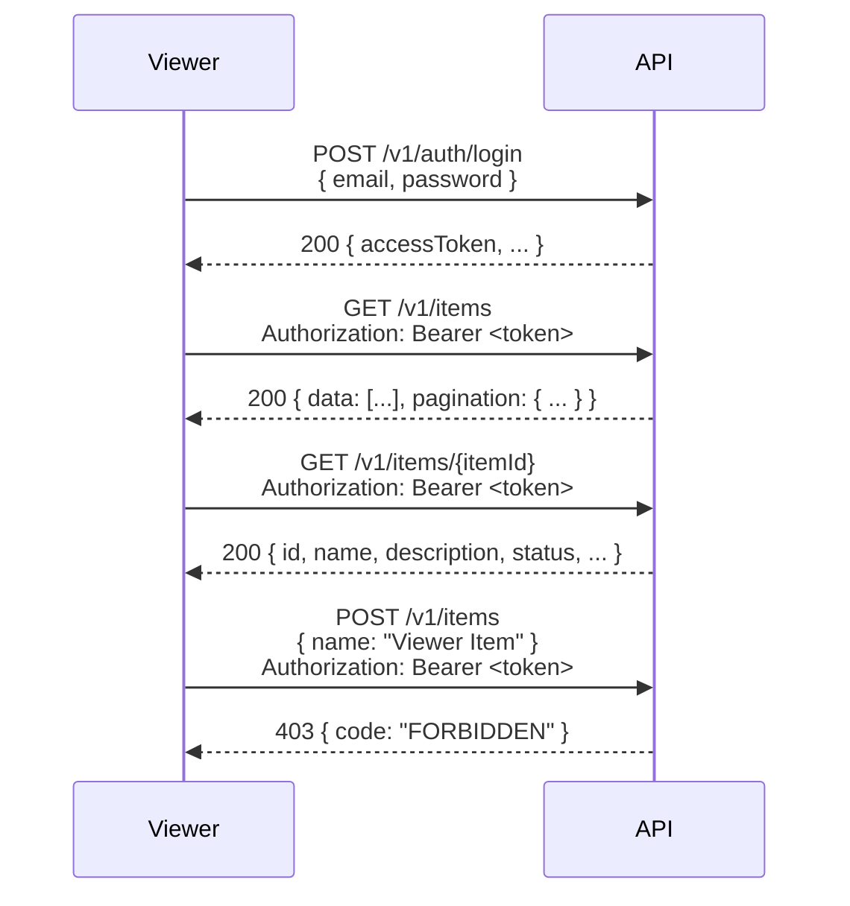
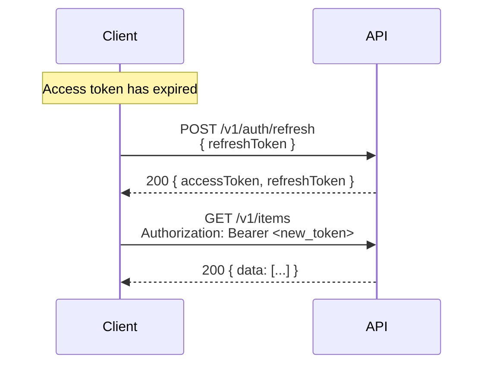

# Sequence Diagrams — Items

> **Example domain.** This is the working reference implementation included with the Domain API Template.
> Replace this file with your own sequence diagrams by running `task domain:init`.

---

## Flow 1: Register and Log In

---

## Flow 2: Contributor Creates and Manages Items

---

## Flow 3: Viewer Browses Items

---

## Flow 4: Token Refresh

---

## Notes

- All authenticated requests include `Authorization: Bearer <token>` (omitted from some diagrams for brevity).
- `4xx` error paths are covered by the auth matrix — see `auth-matrix.md`.
