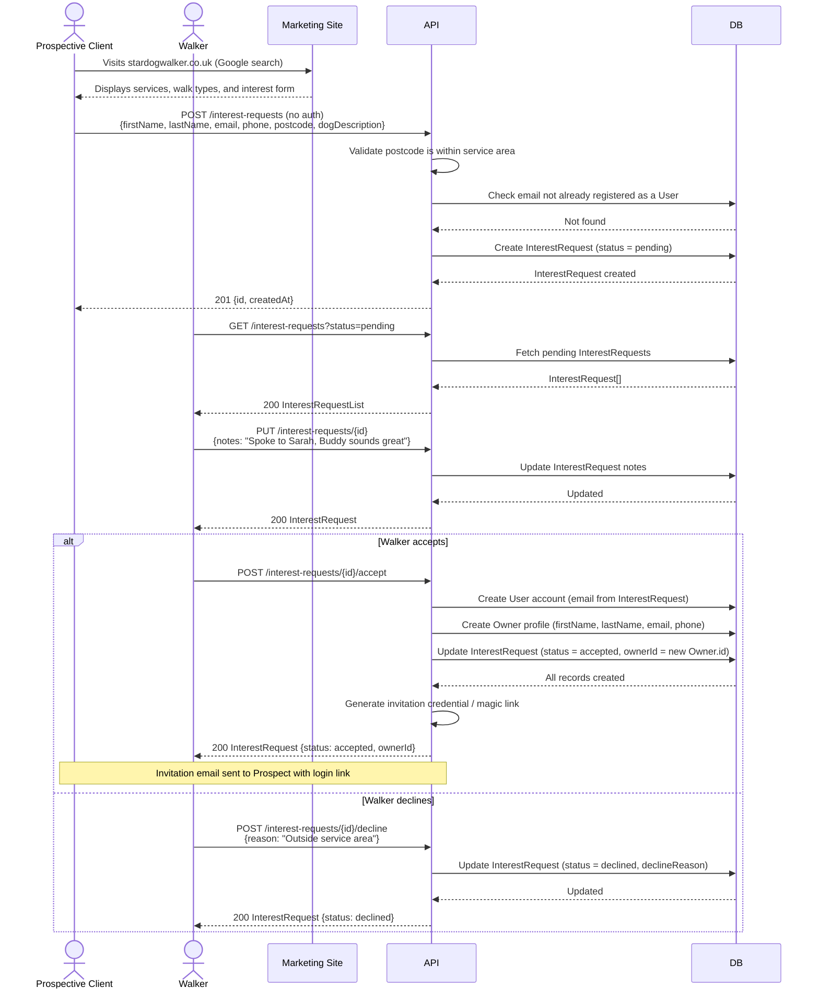
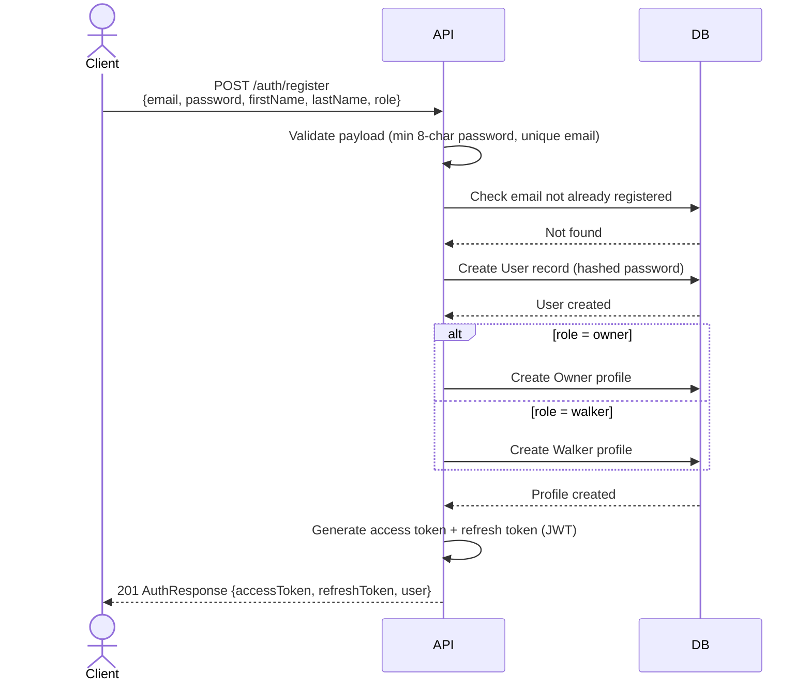
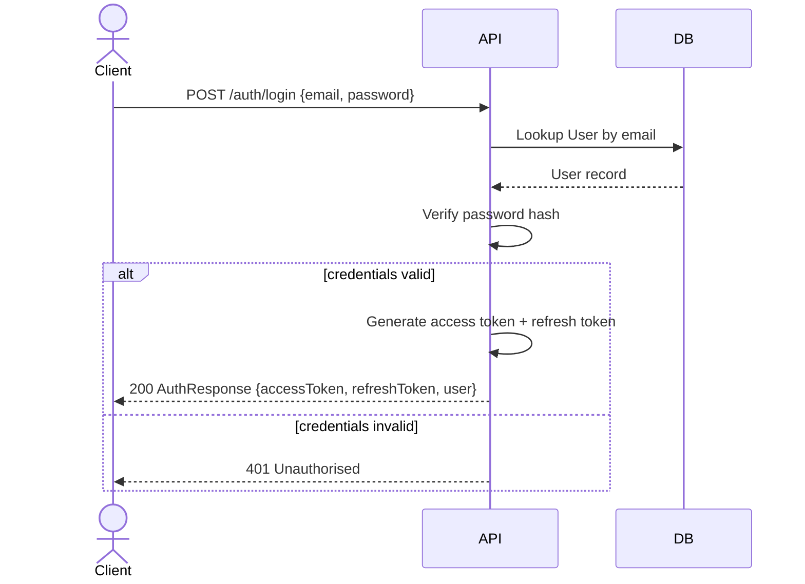
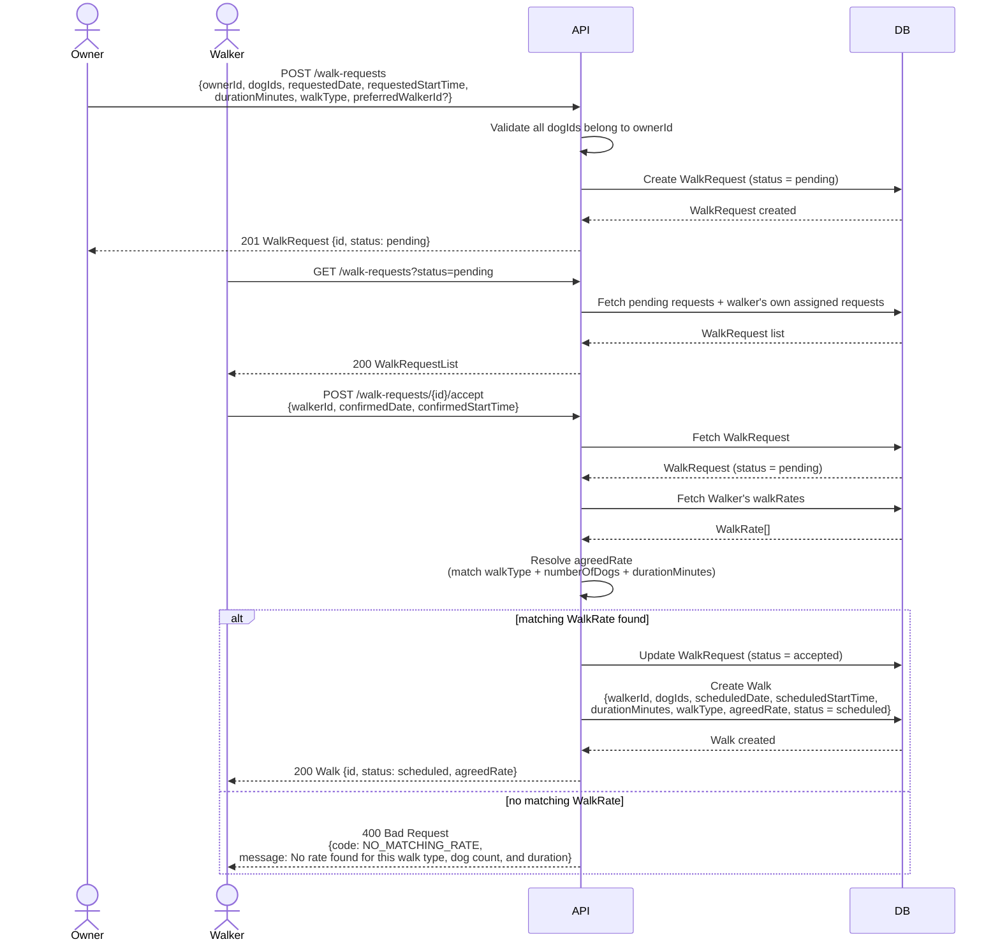
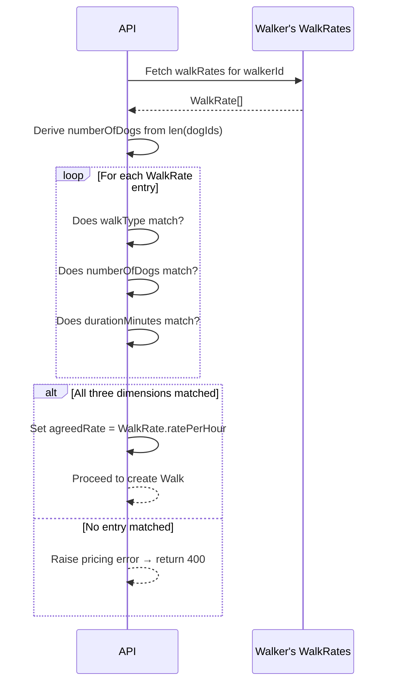
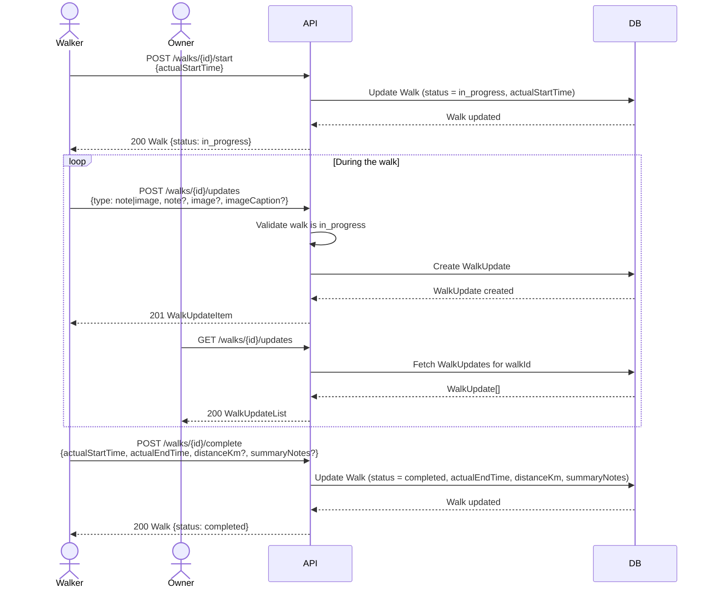
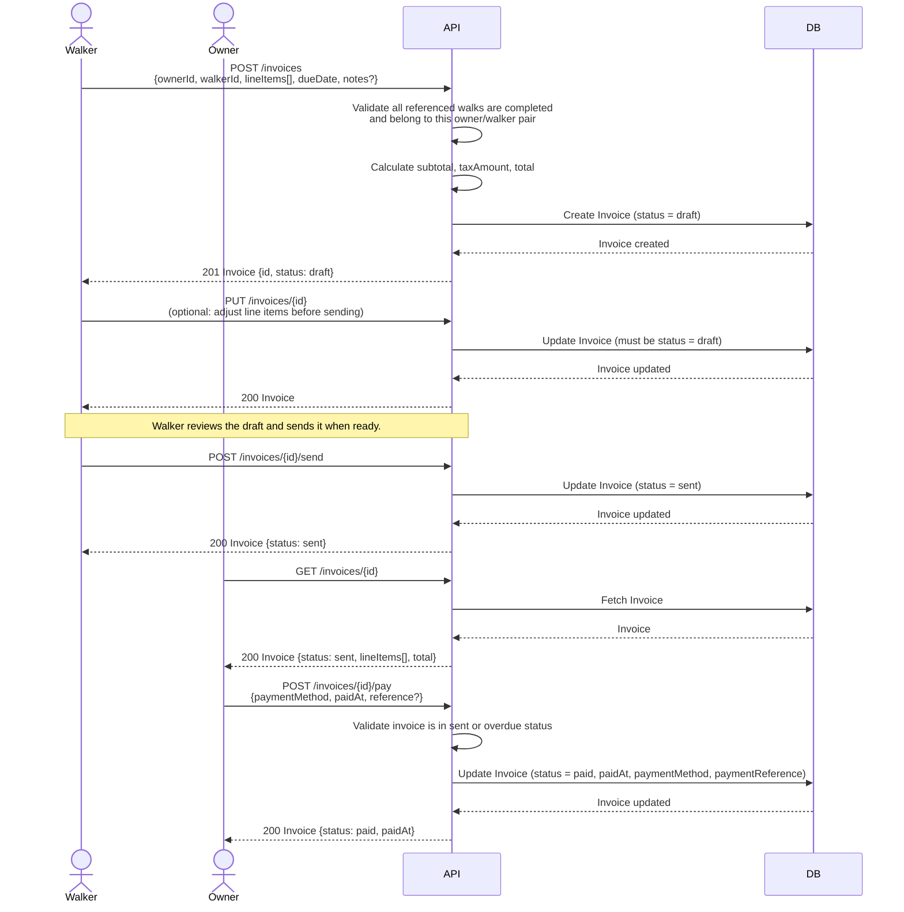
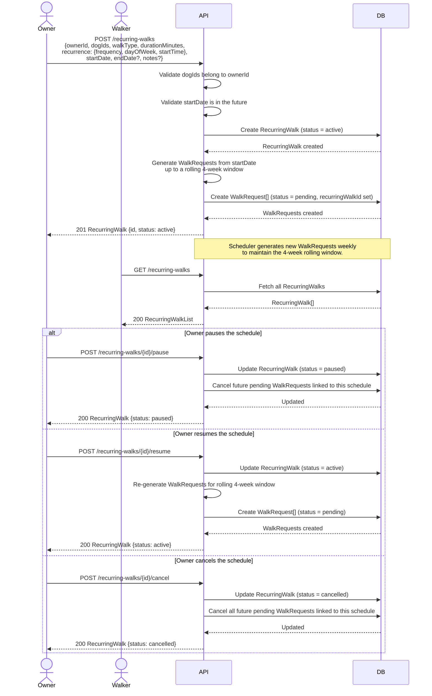

# Sequence Diagrams

Key interaction flows for the Dog Walking Management API, using
[Mermaid](https://mermaid.js.org/) sequence diagrams.

---

## 1. Interest Registration

This flow covers a prospective client discovering the business, registering
their interest via the public marketing site, and the walker converting them
into a full client.

---

## 2. Authentication

### Register

### Login

---

## 3. Walk Booking

This flow covers an owner submitting a walk request and a walker accepting it.
Rate resolution (step 7) is shown in detail in diagram 3.

---

## 4. Rate Resolution

Detailed view of how `agreedRate` is determined when a walker accepts a
walk request. Rate is matched on all three dimensions simultaneously.

---

## 5. Walk Execution

Covers the active phase of a walk, from the walker starting it through to
completion, including real-time updates visible to the owner.

---

## 6. Invoice Flow

Covers a walker raising an invoice for one or more completed walks through
to the owner marking it as paid.

---

## 7. Recurring Walk Setup

Covers an owner creating a recurring walk schedule and the system generating
the first WalkRequests from it.

